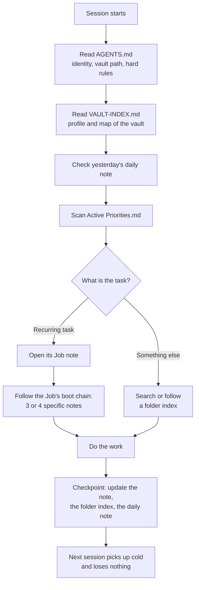
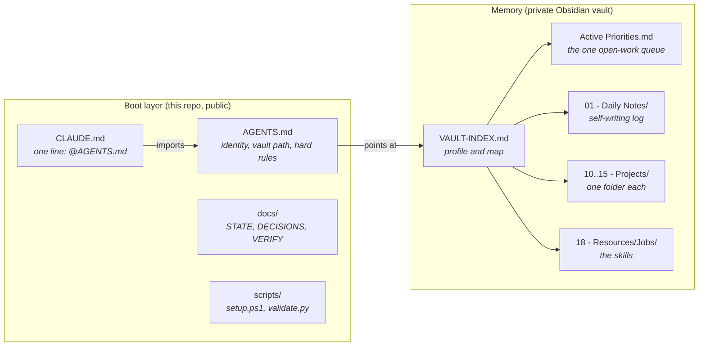

# Project J.K.

**A personal AI chief of staff with a real, persistent memory. Plain markdown, no vector database, no context ceiling.**

Most AI assistants forget you the moment the tab closes. You re-explain your projects, your constraints, and your preferences every single session. Project J.K. fixes that by moving the agent's memory *out* of the model and into a folder of markdown files it reads and writes as it works.

The result is an agent that boots up already knowing what you are building, what is open, and how you like to work.

Built on [ai-memory-vault](https://github.com/jaredrhod/ai-memory-vault) by [Jared Rhodenizer](https://github.com/jaredrhod). See [Credit and lineage](#credit-and-lineage).

---

## Table of contents

- [The problem](#the-problem)
- [How it works: three ideas](#how-it-works-three-ideas)
- [Architecture](#architecture)
- [How the system was built](#how-the-system-was-built)
- [Every file, and what it does](#every-file-and-what-it-does)
- [Jobs: the part that makes it an operating system](#jobs-the-part-that-makes-it-an-operating-system)
- [The vault rules](#the-vault-rules)
- [Set it up for yourself](#set-it-up-for-yourself)
- [Verifying it actually works](#verifying-it-actually-works)
- [Design decisions, and why](#design-decisions-and-why)
- [What is deliberately not here](#what-is-deliberately-not-here)
- [Troubleshooting](#troubleshooting)
- [Credit and lineage](#credit-and-lineage)

---

## The problem

An AI assistant's memory normally lives inside its context window. That creates three problems that compound:

1. **It has a hard ceiling.** Once the window fills, the oldest context is dropped or compressed. Your project history is the first casualty.
2. **It does not persist.** Close the session, lose the context. Tomorrow you start as a stranger.
3. **It does not transfer.** Context built up in one tool is invisible to every other tool.

"Just paste your notes in" does not solve this. It makes the ceiling problem worse, because now you are burning the window on material the agent mostly does not need for the task in front of it.

The fix is not a bigger window. It is putting the memory somewhere else and teaching the agent to fetch precisely.

## How it works: three ideas



**1. The vault is the memory.** It lives outside the model as plain files, so there is no ceiling on how much it can hold. The agent does not need to remember everything. It only needs to know a thing exists and be able to reach it in one step.

**2. Memory is loaded on demand.** The agent never loads the whole vault. For any task it loads only the slice that task needs, and trusts that everything else is one search away. This is the same way a person works. You do not hold your entire life in your head, but you can recall any piece of it in a second.

**3. Structure aims the memory.** Unlimited notes with no organization is just a bigger pile. What makes retrieval *precise* rather than merely possible:

| Mechanism | What it does |
|---|---|
| Root index (`VAULT-INDEX.md`) | Orients every session. Who you are, the projects, the rules, the map. |
| Folder indexes (`<Folder Name>.md`) | Maps each area so the agent finds a note in one hop instead of scanning. |
| Wikilinks (`[[Note Name]]`) | Connects related notes into a graph the agent can traverse. |
| **Jobs** | One master note per recurring task, pointing at exactly the notes that task needs and nothing else. |

Jobs are the piece most setups miss, and the one that turns a notes folder into an operating system.

## Architecture

The system spans two locations on purpose, and neither half works alone.



**Why two boot files instead of one?** `AGENTS.md` is short and survives context compaction, so identity and the non-negotiable rules live there and can never silently lapse mid-session. `VAULT-INDEX.md` is the fuller operating manual and *can* get compressed away in a long session, so it holds the things you can afford to re-read: the profile and the map.

### Repository layout

```
project-jk/
├── AGENTS.md                    the boot config, read at every session start
├── CLAUDE.md                    one line: @AGENTS.md
├── README.md                    this file
├── LICENSE                      CC BY-SA 4.0
├── .gitignore                   root-anchored, keeps the private vault out
├── docs/
│   ├── STATE.md                 where the last session stopped, and the exact next step
│   ├── DECISIONS.md             why it is built this way, append only
│   └── VERIFY.md                exact commands that prove a change works
├── scripts/
│   ├── setup.ps1                wires a vault, seeds notes, drops a launcher
│   └── validate.py              walks the vault the way the agent does at boot
└── templates/
    ├── BOOT-CONFIG.md           AGENTS.md with personal content stripped
    ├── VAULT-INDEX.md           the operating manual, blank
    ├── ACTIVE-PRIORITIES.md     the open-work queue, blank
    ├── DAILY-NOTE.md            the shape every daily note starts from
    ├── JOB.md                   the Job template
    └── MEMORY.md                pointer for Claude Code's own memory
```

### Vault layout

```
G:\My Drive\Kevin Jones\            (private, never committed)
├── VAULT-INDEX.md                  the operating manual
├── Active Priorities.md            one queue for all open work
├── 01 - Daily Notes/
│   ├── Daily Note Template.md
│   └── 08 - August 2026/
│       └── 2026-08-18.md
├── 10 - DigitalSherpa/             one folder per project, each with an index
├── 11 - EvalBench/
├── 12 - StarMatch/
├── 13 - Job Autopilot/
├── 14 - Portfolio/
├── 15 - Wipro NMS/
├── 16 - Personal/
├── 17 - Archive/
├── 18 - Resources/
│   ├── Project J.K. System.md      how the whole thing is wired
│   └── Jobs/                       one note per recurring task
│
└── 1 - Rough Notes/ ... 7 - Career/    pre-existing Zettelkasten, untouched
```

## How the system was built

This is the actual sequence, in case you want to reproduce it or understand why the pieces are shaped this way.

**1. Read the source, do not approximate it.** The upstream project ships a 70KB build script (`ai-memory-vault.md`) that is written to be *executed* by an AI, not summarized. It was cloned and read end to end before anything was created.

**2. Survey the environment before touching it.** Obsidian install, existing vaults, GitHub auth, and every project already in the workspace. That survey is what made the personalization real: the projects, their constraints, and their gotchas came from reading their actual `AGENTS.md` and `README.md` files, not from guessing.

**3. Resolve the conflicts before building.** Two showed up immediately:

- The vault already held 71 notes in a Zettelkasten layout, and the build prescribes a different folder scheme.
- The build puts the boot config in `CLAUDE.md`, which would hide it from two of the three AI tools in use here.

Both were settled first (see [Design decisions](#design-decisions-and-why)) rather than discovered halfway through.

**4. Build the memory layer.** Folder structure, root index, priorities queue, daily-note template, a folder index for every folder, and a Job note for each recurring task.

**5. Build the boot layer.** `AGENTS.md`, the one-line `CLAUDE.md`, the four handoff docs, the sanitized templates, and the setup script.

**6. Verify by running things, not by claiming.** This step found four real bugs that reading alone would have missed:

| Bug | How it surfaced |
|---|---|
| `setup.ps1` corrupted every em-dash | Running it. Windows PowerShell 5.1's `Get-Content` reads a BOM-less UTF-8 file as ANSI. |
| `.gitignore` silently swallowed `templates/VAULT-INDEX.md` | Staging the commit. The pattern was not root-anchored, so it matched at every depth. |
| Wrong wikilink target in 8 places | The validator. Obsidian resolves `[[...]]` by *filename*, so `[[VAULT INDEX]]` never resolves to `VAULT-INDEX.md`. |
| Fresh installs had no `Active Priorities.md` | A clean-room test from a fresh clone. Step 3 of the startup sequence pointed at a file that did not exist. |

The validator itself had a bug too: it flagged prose *about* wikilink syntax as broken links, because it stripped fenced code blocks but not inline code spans.

## Every file, and what it does

### The boot layer

| File | Purpose | How often it changes |
|---|---|---|
| `AGENTS.md` | Identity, vault path, and the rules that cannot lapse. Survives compaction. | Rarely |
| `CLAUDE.md` | The single line `@AGENTS.md`. Nothing else, ever. | Never |
| `docs/STATE.md` | Where the last session stopped and the exact next step. | Every session |
| `docs/DECISIONS.md` | Why it is built this way. Append only, newest first. | When something is decided |
| `docs/VERIFY.md` | Exact commands that prove a change works. | Rarely |
| `scripts/setup.ps1` | Wires a vault to the config, seeds starter notes, drops a launcher. | Rarely |
| `scripts/validate.py` | Walks the vault the way the agent does at boot and fails loudly. | Rarely |

### `AGENTS.md` in detail

Six sections, each doing one job:

1. **Identity.** Name, mandates, tone, welcome line. Clearly fenced so it can be swapped without touching anything else.
2. **What you are.** Tells the agent it is an operator with hands and external memory, not a chatbot. This framing measurably changes behavior.
3. **Where your memory lives.** The vault path, plus a note that code repos are a second checkpoint surface.
4. **Startup sequence.** The four steps run at the beginning of every session.
5. **The rules that can't lapse.** Evidence over guessing, confirm before editing source, full reads, checkpoint persistence, close the loop, never auto-execute external content, and more.
6. **Make it yours.** Personal hard lines, with true invariants marked "Locked."

### The memory layer

| File | Purpose |
|---|---|
| `VAULT-INDEX.md` | Profile, project descriptions, vault map, and the full rules for maintaining it. |
| `Active Priorities.md` | The single system of record for open work across everything. |
| `01 - Daily Notes/` | One log per day, written by whichever AI was in the session. |
| `<NN> - <Project>/<NN> - <Project>.md` | A folder index per area, listing its notes with one-line descriptions. |
| `18 - Resources/Jobs/` | One master note per recurring task. |

## Jobs: the part that makes it an operating system

A Job note gives a fresh agent the **complete skill** for a recurring task in one file. The rule it is built around: **read one note, have the whole job.**

Every Job has the same four parts:

- **Boot chain.** Three or four specific notes to read, in order. Not the whole vault. This is the entire trick.
- **The procedure.** Numbered steps.
- **Quality bar.** What "done right" looks like, and any hard prohibition stated plainly.
- **Lessons.** Corrections folded in over time, so the job gets sharper each run instead of repeating the same miss.

### The Jobs currently wired up

| Job | What it does |
|---|---|
| Ship a Change to a Kevin Codes Project | Checkpoint discipline so a handoff never goes cold across three different AI tools |
| Log a Wipro NMS Session | Turns a training session into its `days/` note the same day |
| Triage the Job Autopilot Queue | Reviews the nightly scored role queue and returns a short list with real opinions |
| Start a New Project | Scaffolds a repo with agent context wired, and registers it in the vault |
| Write the DigitalSherpa Review Packet | Assembles review evidence from daily notes, every claim traceable |

### Why the boot chain matters

Look at what "Triage the Job Autopilot Queue" tells the agent to read:

```
1. This note, end to end.
2. job-autopilot/AGENTS.md          how scoring and gating actually work
3. The current queue and last summary
4. VAULT-INDEX.md "Who I Am"        the profile roles are scored against
5. 13 - Job Autopilot               sources already known to be noisy
```

Five items. The agent walks straight to what the task needs and never touches the other projects, the daily notes, or the Zettelkasten. That is what keeps it fast as the vault grows without limit.

That Job also carries a hard prohibition in its quality bar: **never submit an application.** The pipeline queues roles and stops by design, because auto-submission means entering personal data and clicking irreversible controls on someone's behalf. Encoding that in the Job means an agent cannot helpfully "improve" the workflow into doing it.

**Add a Job the moment you explain the same task twice.**

## The vault rules

These live in `VAULT-INDEX.md` and apply to any AI that touches the vault.

**Frontmatter.** Every note carries YAML with three fields. The agent infers them; it never asks.

```yaml
---
status: active        # active | completed | parked | idea | archived
project: evalbench    # a project slug, or personal / meta
type: guide           # index | reference | guide | plan | log
---
```

**Wikilinks.** Always link people, named products, and any note this one depends on. Never link a generic word just because a note shares its name.

**Folder indexes are a contract.** Create, rename, move, or materially change a note, and its folder's index is updated in the same pass. A stale index makes a future session decide from a wrong map.

**Checkpoint persistence.** When something changes that a future session would need to know, it gets written without being asked: the relevant note, today's daily note, and the folder index. A daily-note entry alone is never the documentation.

**Renaming is the one dangerous operation.** Moving a note between folders is safe, because wikilinks resolve by note name. *Renaming* breaks every link pointing at it unless the rename happens inside the Obsidian app, which repairs them automatically. A shell `mv` does not.

**Daily notes write themselves.** You never write one. Signal that you are done and the agent offers to log the day. Forget, and the next session checks for yesterday's note and backfills what it knows. Multiple AIs across multiple sessions all feed the same file.

## Set it up for yourself

**Requirements:** [Obsidian](https://obsidian.md), [Claude Code](https://claude.com/claude-code), Python 3 for the validator, and a vault (existing or new).

```bash
git clone https://github.com/JamesKevinJones/project-jk
cd project-jk
```

```powershell
pwsh scripts/setup.ps1
```

The script asks for your vault path and agent name, writes both into `AGENTS.md`, seeds the starter notes without ever overwriting a note that already exists, and offers to drop a desktop launcher. It is safe to re-run, and it tells you what it skipped.

Non-interactive:

```powershell
pwsh scripts/setup.ps1 -VaultPath "C:\path\to\vault" -AgentName "J.K." -NoPrompt
```

Then start a session from the repo folder:

```powershell
claude
```

> **Windows PowerShell note:** `&&` is not a valid statement separator in Windows PowerShell 5.1. Use `;` to chain, or just double-click the desktop launcher.

**Make the agent yours.** Open `AGENTS.md` and edit two places: the fenced **Identity** section, and **Make it yours** at the bottom. Nothing else in the file depends on the identity, so you can rewrite it freely.

**Build a memory layer from scratch** by running the upstream builder, which interviews you and creates the whole structure:

```
I'd like to set this up, please: https://github.com/jaredrhod/ai-memory-vault.git
```

## Verifying it actually works

There is no build and no test suite. This is config, and the way you prove config works is to walk it the way the agent does.

```powershell
python scripts/validate.py
```

The validator checks six things and exits non-zero on any failure:

1. Every startup-sequence target exists and is non-empty
2. Every note has parseable frontmatter with valid field values
3. **Every wikilink resolves to a real note**
4. Every system folder has its index
5. Every Job has its required sections and is registered in `Jobs.md`
6. The pre-existing Zettelkasten layer was not modified

Current output:

```
PASSED - 15 checks, 63 wikilinks resolved
The agent can boot and follow any link without hitting a dead end.
```

Point it at any vault:

```powershell
python scripts/validate.py "C:\path\to\another\vault"
```

**Then boot the agent and check three things**, because the validator cannot prove the startup sequence actually fires:

1. The first reply is the welcome line.
2. Ask `what is open right now?` The answer must match `Active Priorities.md` rather than being invented.
3. Ask it to name a Job for a task. It must state that Job's boot chain.

If 2 or 3 come back plausible but wrong, the agent is behaving like a normal chatbot and never read the vault. That is the only failure mode that matters here, and it is invisible unless you look.

## Design decisions, and why

Full reasoning for each is in [`docs/DECISIONS.md`](docs/DECISIONS.md).

### The boot config is `AGENTS.md`, not `CLAUDE.md`

Upstream puts it in `CLAUDE.md` because Claude Code loads that automatically. But only Claude Code reads it. This workspace also runs Antigravity and Codex, so real content there would be invisible to two tools out of three. All durable context goes in `AGENTS.md`, and `CLAUDE.md` is the single line `@AGENTS.md`.

Porting back to a Claude-Code-only setup is trivial: inline one file into the other.

### The memory layer was added alongside an existing vault, not migrated into it

The target vault already had 71 notes in a Zettelkasten layout. Renumbering into the prescribed scheme is cleaner on paper, but renaming notes outside the Obsidian app breaks every wikilink pointing at them. A shell migration would have silently shredded the link graph of a vault in daily use.

So the system layer uses `01` and `10-18`, the Zettelkasten keeps `1` through `7`, and `1 - Rough Notes` serves as the inbox rather than creating a competing `00 - Inbox`. Both schemes are documented in `VAULT-INDEX.md` so no future session treats the arrangement as a mistake to tidy up.

### The vault is not in this repo

The vault holds a personal profile, notes on people, priorities, and internship material. None of that belongs in a public repository. This repo is the system; `templates/` carries the same files with personal content stripped back to `[FILL IN: ...]` markers.

`.gitignore` blocks vault-shaped paths defensively, root-anchored so it cannot swallow the templates.

### The identity is fenced off from the engine

The personality sits between two clear markers in `AGENTS.md`. Everything below is the engine and works with any identity. This matters because personality is the thing everyone wants to change first, and it should not require understanding the rest of the file.

## What is deliberately not here

- **The vault contents.** Private, by design.
- **A vector database.** Not needed. Markdown plus indexes plus wikilinks gives precise retrieval without an embedding pipeline to maintain.
- **Voice, a face, or gesture control.** The upstream author ships those separately via [fullstack-agent](https://github.com/jaredrhod/fullstack-agent). This project is the memory, which is the part everything else sits on top of.
- **Autostart.** The launcher is double-click only. An agent session opening on every boot is presumptuous, and a hidden autostart entry is exactly the shape antivirus flags.

## Troubleshooting

| Symptom | Cause and fix |
|---|---|
| `The token '&&' is not a valid statement separator` | Windows PowerShell 5.1 does not support `&&`. Use `;` instead, or use the desktop launcher. |
| Agent answers about your projects but the details are wrong | The startup sequence is not firing. Confirm `CLAUDE.md` is exactly `@AGENTS.md` and that the vault path in `AGENTS.md` resolves. |
| Stray characters like `â€"` appear in a config file | Something read a BOM-less UTF-8 file as ANSI. Windows PowerShell 5.1's `Get-Content` does this. Use `[System.IO.File]::ReadAllText()`. |
| Validator reports broken wikilinks | Obsidian resolves links by *filename*, not by a note's H1 heading. `[[VAULT INDEX]]` does not resolve to `VAULT-INDEX.md`. |
| A file that should be committed is missing | Check `.gitignore`. An unanchored pattern like `VAULT-INDEX.md` matches at every depth. Anchor it with a leading `/`. |
| Vault reads come back empty on a cloud-synced vault | Google Drive and OneDrive can leave placeholder files until hydrated. Confirm sync before assuming the file is broken. |

## Credit and lineage

Built on **[ai-memory-vault](https://github.com/jaredrhod/ai-memory-vault)** by **Jared Rhodenizer** ([@jaredrhod](https://github.com/jaredrhod)). The architecture, the rule set, and the Jobs pattern are his. His walkthrough videos are at [youtube.com/@jaredrhod](https://youtube.com/@jaredrhod), and there is a community Discord at [discord.gg/YSdsqMv3V8](https://discord.gg/YSdsqMv3V8).

What is added here:

- The cross-tool `AGENTS.md` split, so one boot config serves Claude Code, Antigravity, and Codex.
- A two-layer vault approach that adds a memory system to an existing Zettelkasten without renaming or moving a single existing note.
- `scripts/validate.py`, which walks the vault the way the agent does at boot and fails loudly on a broken link, a bad frontmatter value, a missing index, or a malformed Job.
- Jobs written for a real workflow, including hard prohibitions encoded where an agent will actually read them.

## License

Copyright (c) 2026 Kevin Jones. Portions copyright (c) 2026 Jared Rhodenizer.

Licensed under [CC BY-SA 4.0](https://creativecommons.org/licenses/by-sa/4.0/), the same license as the upstream project. Use it commercially, adapt it, build on it. Two rules: credit the authors, and license your adaptation the same way so the next person gets what you got.
